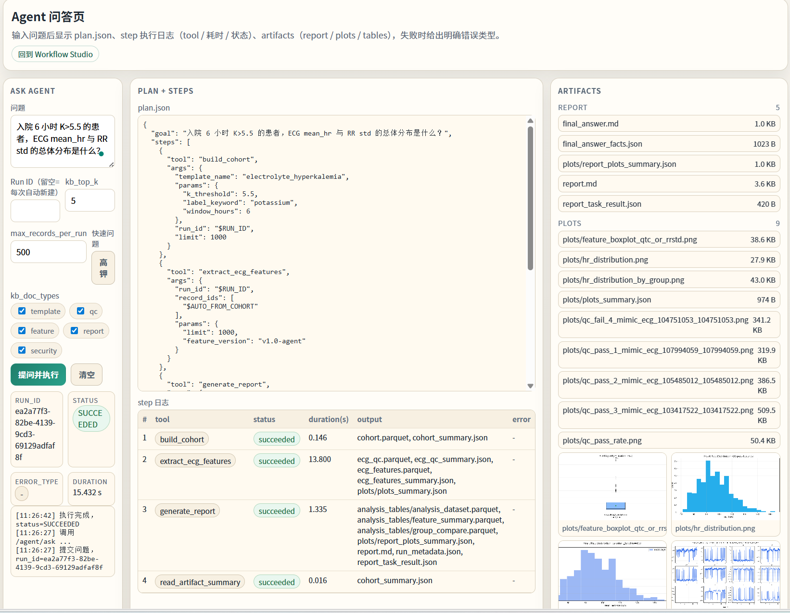
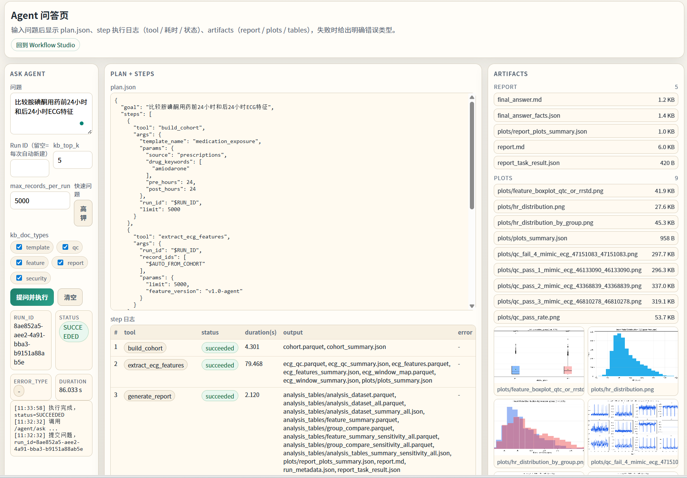
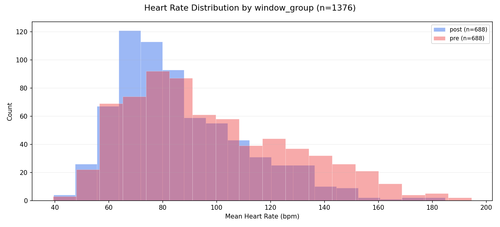

# ECG 研究 Copilot

一个本地优先（local-first）、可审计的 ECG 研究 Copilot：把自然语言研究问题转换成可复现的数据分析流程、结构化产物和可追溯结论。

## 项目简介

这个项目把传统 ECG 分析管线升级成了一个受约束的智能体系统：

1. 用户输入自然语言问题。
2. Planner 生成结构化 `plan.json`。
3. Tool Executor 只调用白名单工具，并校验参数。
4. 数据流程执行建队列、ECG 质控、特征提取、统计分析和报告生成。
5. 最终答案只允许基于 artifacts 生成，不允许直接靠模型记忆编写。

典型输出包括：

- `cohort.parquet`
- `ecg_qc.parquet`
- `ecg_features.parquet`
- `analysis_tables/*.parquet`
- `plots/*.png`
- `report.md`
- `final_answer.md`
- `agent_trace.json`

## 解决的问题

很多 LLM + 数据项目停留在“问一句，回一句”的层面，缺少执行约束、证据追溯和审计能力。这个项目的重点不是聊天，而是把研究问题落成一个可执行、可检查、可复现的流程。

核心原则：

- 本地执行，数据不出域
- 回答必须落地到产物
- 工具调用可审计
- 参数必须过 schema 校验
- 检索结果要过注入过滤
- 禁止输出患者级明细

## 系统架构

主流程：

```text
研究问题
  -> Planner
  -> Tool Registry / Tool Executor
  -> 数据流程
  -> Artifacts
  -> Answer Writer
  -> Final Answer
```

核心组件：

- `services/api/app/agent/planner.py`
  - 结合知识库上下文生成严格 JSON 计划
- `services/api/app/agent/tool_registry.py`
  - 定义允许调用的工具和输入 schema
- `services/api/app/agent/tool_executor.py`
  - 做参数校验、权限控制、超时处理和审计记录
- `services/api/app/agent/runner.py`
  - 顺序执行 agent 工作流并写出 `agent_trace.json`
- `services/api/app/agent/answer_writer.py`
  - 仅基于 artifacts 和摘要生成最终回答
- `pipelines/`
  - 包含 cohort 构建、ECG 质控、特征提取、分析表构建、绘图与报告生成

## 主要能力

### 1. Planner + 工具执行

系统不会直接自由生成答案，而是先把问题转成结构化执行计划，再逐步调用工具。

### 2. 白名单与参数校验

只有注册过的工具才能执行；参数不符合 Pydantic schema 时会在执行前被拒绝。

### 3. 基于产物的回答生成

`final_answer.md` 中的关键数字必须来自生成的 artifacts，例如 `cohort_summary.json` 或 `analysis_tables/*.parquet` 的摘要结果。

### 4. 安全限制

系统会拒绝或降级处理以下请求：

- 导出患者级标识或明细
- 忽略既有安全规则
- 试图执行破坏性指令
- 超出约束范围的大规模请求

### 5. Eval 与 CI

仓库内置了以下检查能力：

- cohort 检查
- ECG / QC 检查
- report 检查
- agent smoke eval
- GitHub Actions 自动化校验

## 技术栈

- FastAPI
- PostgreSQL
- Redis
- Docker Compose
- Ollama（`qwen3:14b`、`qwen3-embedding:0.6b`）
- Pandas / Parquet artifacts
- pytest + GitHub Actions

## 仓库结构

```text
services/api/        FastAPI 接口、agent 编排、路由与测试
pipelines/           ECG 数据流程与报告生成逻辑
evals/               gold questions、agent tests、评测脚本与检查器
knowledge_base/      模板、QC 规则、特征定义、安全策略等知识库文档
scripts/             数据导入、manifest 构建、模式切换、辅助脚本
config/              schema 白名单与配置
```

## 快速开始

### 1. 启动服务

```powershell
docker compose up --build -d
```

### 2. 检查 API 健康状态

```powershell
curl http://127.0.0.1:8000/health
```

### 3. 打开界面

- Cohort UI：`http://127.0.0.1:8000/ui/`
- Agent UI：`http://127.0.0.1:8000/ui/agent`

## 示例问题

- `入院 6 小时 K>5.5 的患者，ECG mean_hr 与 RR std 的总体分布是什么？`
- `比较胺碘酮用药前24小时和后24小时ECG特征`
- `AF患者住院期间的ECG风险分层`

## 界面与结果示例

### 1. Agent 问答页：高钾问题

展示自然语言问题、`plan.json`、step 日志和 artifacts 列表。



### 2. Agent 问答页：药物前后窗分析

展示药物暴露问题如何被解析成前后窗分析流程，并输出报告与图表。



### 3. 结果图示例：前后窗心率分布

展示药物暴露前后窗口的 ECG 心率分布对比。



## 评测

快速回归：

```bash
make eval_smoke
make eval_agent_smoke
```

相关文件：

- `evals/gold_questions.yaml`
- `evals/agent_tests.yaml`
- `evals/check_cohort.py`
- `evals/check_ecg.py`
- `evals/check_report.py`

## 数据说明

这个公开仓库不包含：

- MIMIC-IV 原始临床数据
- MIMIC-IV-ECG 波形数据
- 运行生成的 artifacts
- 本地开发环境存储目录

Demo / smoke 流程通过运行时下载公开 demo 数据完成验证，而不是把数据直接放进 Git 仓库。

## 安全与约束

详见 `SECURITY.md`。

当前实现的关键限制包括：

- 工具白名单
- Pydantic schema 校验
- 审计日志
- RAG 检索片段注入过滤
- 最终回答禁止患者级导出
- 小样本分组隐藏

## 当前限制

这个项目是研究辅助系统，不是临床决策系统。

当前仍有这些限制：

- ECG 特征覆盖还不完整，尤其不适合夸大为强风险分层系统
- 某些疾病和药物映射仍依赖人工维护的 alias map 与 fallback 模板
- 最终结论仍受 cohort 定义、缺失、混杂和时间窗设计影响
